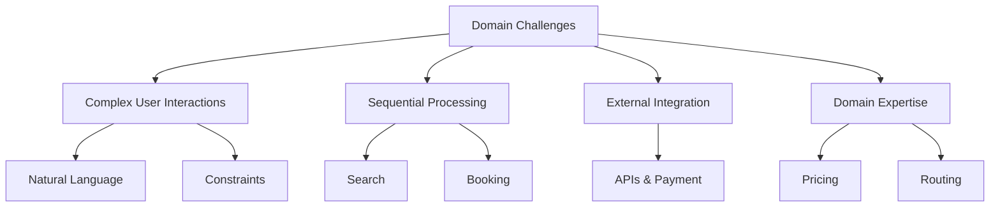
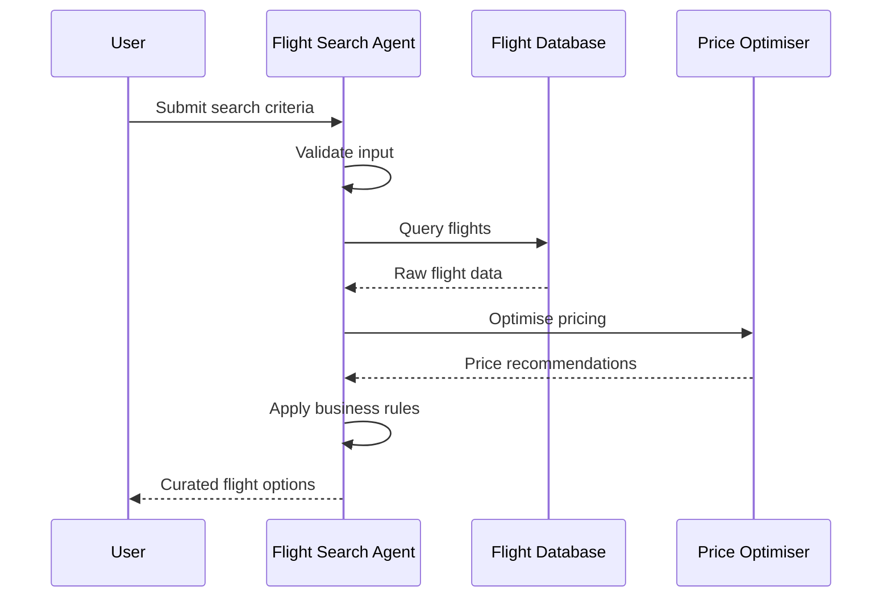
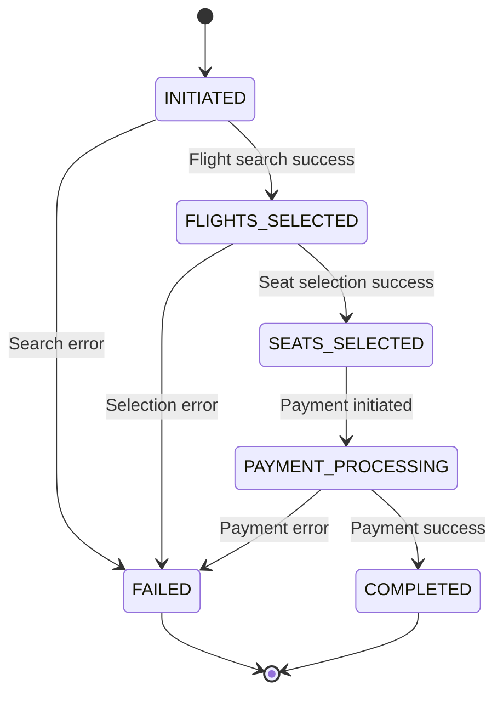
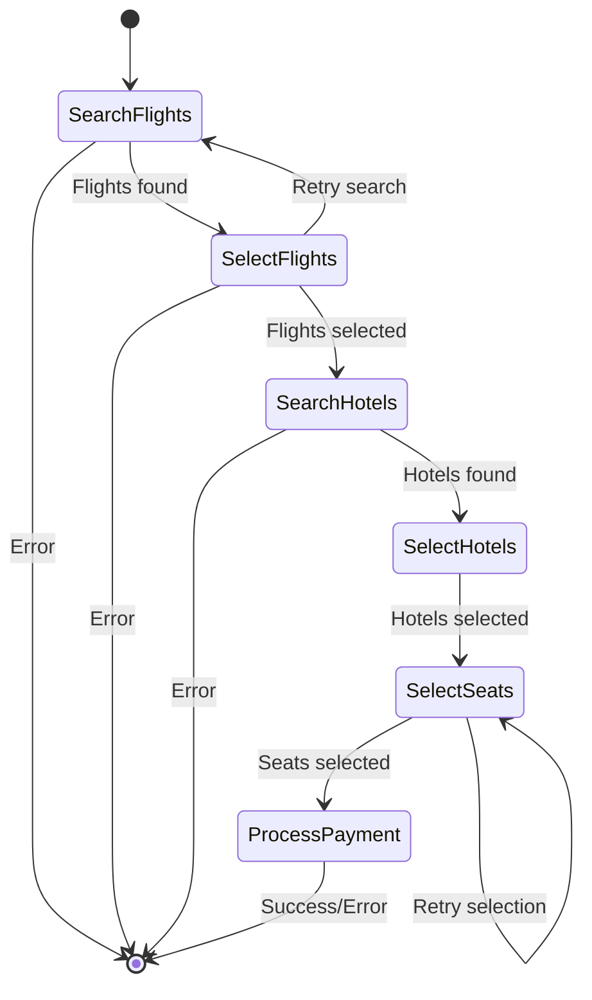

# Multi-Agent Patterns: A Practical Guide


> For instructions on how to run the code in this repository, see the README in my [Python UV Template](https://github.com/jagreehal/python-uv-template) repository.

## Table of Contents

- [Introduction](#introduction)
- [The Domain Challenge](#the-domain-challenge)
- [Pattern 1: Single Agent Workflows](#pattern-1-single-agent-workflows)
- [Pattern 2: Agent Delegation](#pattern-2-agent-delegation)
- [Pattern 3: Programmatic Agent Hand-off](#pattern-3-programmatic-agent-hand-off)
- [Pattern 4: Graph-based Control Flow](#pattern-4-graph-based-control-flow)
- [Choosing the Right Pattern](#choosing-the-right-pattern)
- [Best Practices](#best-practices)
- [Conclusion](#conclusion)
- [Further Reading](#further-reading)

## Introduction

AI applications are shifting from monolithic large language models to modular, multi-agent systems—a transformation that enhances performance, flexibility, and maintainability.

In my talk about AI Agents last September, I said AI agents would become increasingly popular, and today, we see this shift happening across industries. By breaking down complex tasks into specialized components, engineers can design smarter, more scalable AI workflows.

In this guide, we'll explore four key multi-agent patterns, using travel booking as an example. You'll learn how to choose the right pattern for your application, implementation strategies, and error-handling techniques to build robust multi-agent AI systems.

## The Domain Challenge

While our examples focus on travel applications, the challenges addressed here are common across many industries:

### Complex User Interactions

- Interpreting natural language preferences
- Processing dates, locations and multi-step workflows

### Sequential Processing Requirements

- Searching and filtering (e.g. flight searches)
- Selecting seats, ancillary services, payment processing, and final confirmation

### External System Integration

- Interacting with airline reservation systems, payment gateways, hotel PMS, etc.

### Domain Expertise Requirements

- Understanding fare rules, pricing optimisation, route planning, and travel regulations

Below is a mermaid diagram that visualises these challenges:



## Pattern 1: Single Agent Workflows

### Implementation Details

The Single Agent Workflow pattern is ideal for focused, well-defined tasks. Here's a simplified example of a flight search agent:

```python
from pydantic import BaseModel
from typing import List, Optional
from datetime import date

class FlightDetails(BaseModel):
    flight_number: str
    price: float
    origin: str
    destination: str
    departure_date: date
    arrival_date: date
    duration_hours: float

class FlightSearchResult(BaseModel):
    found_flights: List[FlightDetails]
    best_flight: Optional[FlightDetails] = None
    explanation: str

class FlightSearchAgent:
    def __init__(self, model: str):
        self.system_prompt = """You are a flight search expert. Your job is to:
        1. Search available flights using the search_flights tool
        2. Analyze the results to find the best option based on price and duration
        3. Provide a clear explanation of why you chose that flight
        """
        # ... initialization code ...

    async def search_flights(self, origin: str, destination: str, date: date) -> List[FlightDetails]:
        # Implementation to search flights
        pass
```

### When to Use Single Agent Workflows

Single Agent Workflows are most effective when:

- **Task Boundaries are Clear:**

  - E.g. flight searches with specific criteria, seat selection, or baggage allowance calculations.

- **Minimal State Management is Required:**
  - Ideal for one-off, stateless queries and independent transactions.
- **Performance is Critical:**
  - Such as in real-time pricing updates or immediate availability checks.

### Implementation Considerations

| Aspect           | Consideration                               | Example                                  |
| ---------------- | ------------------------------------------- | ---------------------------------------- |
| Input Validation | Ensure all required parameters are provided | Check date formats, airport codes        |
| Error Handling   | Comprehensive error catching is essential   | Handling API timeouts, invalid responses |
| Response Format  | Structure responses for easy consumption    | Use Pydantic models for type safety      |
| Monitoring       | Track performance and success rates         | Log response times and error rates       |

### Code Example: Error Handling

Robust error handling is crucial. The example below demonstrates how to implement retries with exponential backoff:

```python
class FlightSearchError(Exception):
    """Base exception for flight search errors"""
    pass

class InvalidSearchCriteriaError(FlightSearchError):
    """Raised when search criteria is invalid"""
    pass

async def search_with_retries(self, criteria: FlightSearchCriteria, max_retries: int = 3) -> List[FlightSearchResult]:
 retry_count = 0
    while retry_count < max_retries:
        try:
            return await self._perform_search(criteria)
        except FlightSearchError as e:
 retry_count += 1
            if retry_count == max_retries:
                raise
            await asyncio.sleep(1 * retry_count)  # Exponential backoff
```

A corresponding sequence diagram visualises the process:



## Pattern 2: Agent Delegation

### Implementation Architecture

The Agent Delegation pattern uses a controller agent to coordinate specialized delegate agents. Here's a simplified example:

```python
from typing import List, Optional
from datetime import date
from pydantic import BaseModel

class TravelPlan(BaseModel):
    outbound_flight: FlightDetails
    return_flight: Optional[FlightDetails]
    hotel_recommendations: List[str]
    activity_suggestions: List[str]
    total_budget: float

# Flight search agent (delegate)
flight_search_agent = Agent(
    model="gpt-4",
    result_type=List[FlightDetails],
    system_prompt="You are a flight search specialist. Find the best flights matching the given criteria."
)

# Travel planner agent (controller)
travel_planner_agent = Agent(
    model="gpt-4",
    result_type=TravelPlan,
    system_prompt="""You are a travel planning expert. Your job is to:
    1. Use the flight_search tool to find suitable flights
    2. Suggest hotels and activities at the destination
    3. Calculate total budget including flights and estimated other expenses
    """
)
```

### Benefits and Trade-offs

| Aspect      | Benefits                            | Trade-offs                       |
| ----------- | ----------------------------------- | -------------------------------- |
| Modularity  | Clear division of responsibilities  | Increased system complexity      |
| Scalability | Easy to add specialist agents       | More points of failure           |
| Maintenance | Agents can be updated independently | Requires robust error handling   |
| Performance | Parallel processing is possible     | Additional coordination overhead |

### Error Handling Strategies

Coordinated error handling is key. For example:

```python
class TravelPlanningError(Exception):
    """Base exception for travel planning errors"""
    pass

class AgentCoordinationError(TravelPlanningError):
    """Raised when agent coordination fails"""
    pass

class TravelPlannerAgent:
    async def create_travel_plan_with_fallback(self, origin: str, destination: str, dates: Dict[str, datetime], preferences: Dict[str, any]) -> TravelPlan:
        try:
            return await self.create_travel_plan(origin, destination, dates, preferences)
        except FlightSearchError:  # Fallback to alternative dates or routes
            return await self._handle_flight_search_failure(origin, destination, dates, preferences)
        except HotelSearchError:  # Fallback to alternative accommodations
            return await self._handle_hotel_search_failure(destination, dates, preferences)
        except ActivityPlanningError:  # Create a plan without activities
            return await self._create_basic_travel_plan(origin, destination, dates, preferences)
```

### Implementation Considerations

- **Agent Communication:** Use standardised message formats and implement retry mechanisms.

- **State Management:** Track the progress of each sub-agent and maintain booking consistency.

- **Monitoring and Logging:** Monitor performance metrics and log coordination events.

- **Testing:** Unit test individual agents and integration test their interactions.

## Pattern 3: Programmatic Agent Hand-off

### Implementation Details

This pattern manages explicit transitions between specialized agents:

```python
# Flight search agent
flight_search_agent = Agent(
    model="gpt-4",
    result_type=List[FlightDetails],
    system_prompt="Find available flights matching the search criteria."
)

# Seat selection agent
seat_selection_agent = Agent(
    model="gpt-4",
    result_type=SeatPreference,
    system_prompt="""Help users select their seat based on their preferences.
    - Rows 1, 14, and 20 have extra legroom
    - Seats A and F are window seats
    """
)

# Payment processing agent
payment_agent = Agent(
    model="gpt-4",
    result_type=PaymentResult,
    system_prompt="Process payment and generate booking confirmation."
)

async def process_booking():
    # Step 1: Search for flights
    flight = await search_flights(usage=usage, origin="SFO", destination="JFK", travel_date=date(2024, 5, 1))

    # Step 2: Select seat
    seat = await select_seat(usage=usage, preferences="window seat with extra legroom")

    # Step 3: Process payment
    payment_result = await process_payment(usage=usage, flight=flight, seat=seat, payment_info="Credit card ending in 1234")
```

### Error Handling Strategies

Key aspects include state-based recovery, graceful degradation, and robust monitoring. Below is a mermaid state diagram illustrating possible transitions:



### Usage Example

An API endpoint that processes a booking using the orchestrator:

```python
@router.post("/bookings")
async def create_booking(booking_request: BookingRequest, orchestrator: BookingOrchestrator = Depends(get_orchestrator)) -> BookingResponse:
 context = BookingContext(
        booking_id=generate_booking_id(),
        state=BookingState.INITIATED,
        user_id=booking_request.user_id,
        search_criteria=booking_request.search_criteria,
        created_at=datetime.utcnow(),
        updated_at=datetime.utcnow()
    )

 final_context = await orchestrator.process_booking(context)

    return BookingResponse(
        booking_id=final_context.booking_id,
        status=final_context.state.value,
        error=final_context.error,
        flights=final_context.flights,
        seats=final_context.selected_seats,
        payment_info=final_context.payment_info
    )
```

### Implementation Considerations

- **State Management:** Persist the BookingContext (e.g. using a database).

- **Retry Strategies:** Use exponential backoff where necessary.

- **Transaction Boundaries:** Maintain atomicity of state transitions.

- **Monitoring:** Record state transition times and error counts.

## Pattern 4: Graph-based Control Flow

### Implementation Details

This pattern uses a graph structure to manage complex workflows:

```python
@dataclass
class BookingState:
    """State maintained throughout the booking process."""
    origin: str
    destination: str
    travel_date: date
    selected_flight: Optional[FlightDetails] = None
    selected_seat: Optional[SeatPreference] = None
    payment_info: Optional[str] = None
    booking_confirmed: bool = False
    agent_messages: Dict[str, List[ModelMessage]] = field(default_factory=dict)

@dataclass
class SearchFlights(BaseNode[BookingState]):
    """Search for available flights."""
    async def run(self, ctx: GraphRunContext[BookingState]) -> BaseNode[BookingState] | End[None]:
        result = await flight_search_agent.run(
            f"Find flights from {ctx.state.origin} to {ctx.state.destination} on {ctx.state.travel_date}"
        )
        ctx.state.selected_flight = result.data[0]
        return SelectSeat()

@dataclass
class SelectSeat(BaseNode[BookingState]):
    """Select seat preferences for the flight."""
    async def run(self, ctx: GraphRunContext[BookingState]) -> BaseNode[BookingState]:
        result = await seat_selection_agent.run("I'd like a window seat with extra legroom if possible")
        ctx.state.selected_seat = result.data
        return ProcessPayment()
```

### Implementation Considerations

- **State Design:** Define clear transitions and metadata.

- **Error Recovery:** Implement retryable and monitored nodes.

- **Monitoring and Metrics:** Track execution times, transitions, and errors.

Below is a mermaid diagram representing a typical graph-based workflow:



### Usage Example

An API endpoint employing a graph-based runner might look like this:

```python
@router.post("/bookings/graph")
async def create_booking_graph(booking_request: BookingRequest, runner: BookingGraphRunner = Depends(get_graph_runner)) -> BookingResponse:
 initial_state = BookingGraphState(
        booking_id=generate_booking_id(),
        user_id=booking_request.user_id,
        origin=booking_request.origin,
        destination=booking_request.destination,
        dates=booking_request.dates,
        preferences=booking_request.preferences,
        agent_messages={}
    )
 final_state = await runner.run(initial_state)
    return BookingResponse(
        booking_id=final_state.booking_id,
        status="completed" if not final_state.error else "failed",
        error=final_state.error,
        flights=final_state.flights,
        hotels=final_state.hotels,
        selected_seats=final_state.selected_seats,
        payment_info=final_state.payment_info
    )
```

## Choosing the Right Pattern

### Comparative Analysis

| Aspect            | Single Agent | Agent Delegation | Programmatic Hand-off | Graph-based Flow |
| ----------------- | ------------ | ---------------- | --------------------- | ---------------- |
| Complexity        | Low          | Medium           | High                  | Very High        |
| State Management  | Simple       | Moderate         | Complex               | Very Complex     |
| Error Handling    | Basic        | Coordinated      | Programmatic          | Comprehensive    |
| Scalability       | Limited      | Good             | Very Good             | Excellent        |
| Development Speed | Fast         | Medium           | Slow                  | Very Slow        |
| Maintenance       | Easy         | Moderate         | Complex               | Very Complex     |
| Flexibility       | Limited      | Good             | Very Good             | Excellent        |
| Monitoring        | Simple       | Moderate         | Complex               | Very Complex     |

### Real-World Applications

#### Flight Booking Systems

Example: A multi-city flight booking system using Graph-based Flow to manage complex routing.

#### Hotel Booking Systems

Example: Using Agent Delegation for optimised hotel search and pricing.

#### Travel Package Systems

Example: Building dynamic packages via Programmatic Hand-off to sequence flights, hotels and activities.

#### Travel Itinerary Systems

Example: Employing Single Agent Workflows for fast, AI-powered itinerary optimisation.

## Best Practices

### Pattern Selection

- Begin with the most straightforward pattern that meets your needs.
- Consider future scalability and complexity before adding layers.

### Implementation

- Use strong typing with Pydantic models.
- Incorporate comprehensive logging and monitoring.
- Build robust error handling and retry strategies.

### Testing

- Unit test individual agents.
- Integration test agent interactions.
- Execute end-to-end tests and stress-test state management.

### Monitoring

- Track performance metrics and state transitions.
- Log error rates and adjust retry strategies as needed.

## Conclusion

Multi-agent patterns provide a structured and scalable approach to managing complex tasks in modern applications.

Whether you're implementing a simple, single-agent workflow or a comprehensive, graph-based control flow, the right pattern will ensure clarity, reliability and an excellent user experience.

By following these best practices and real-world examples from the travel domain, you can build robust and adaptable systems.

## Further Reading

- [Building Effective Agents (Anthropic Research)](https://www.anthropic.com/research/building-effective-agents)
- [PydanticAI Documentation](https://ai.pydantic.dev/)
- [Multi-Agent Patterns Repository](https://github.com/jreehal/multi-agent-patterns-pydantic-ai)
